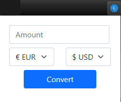
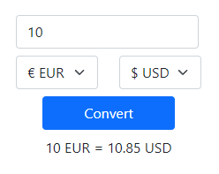

## Lets Talk Money

This is a simple and clean Chrome Extension that let's you convert up to 20 different most used currencies!

- Register/Login in API Ninjas 
- Go to "My Account" and copy your API KEY
- Paste your API KEY in the exchange.js file (instructions in file)
- Install the chrome extension on your browser
    - Go to Chrome Extensions
    - Enable Developer Mode
    - Click Load unpacked
    - Select Folder
- Click the newly added Let's Talk Money Extension
- Choose the amount
- Choose from and to which currency
- Converted!

Now you can more easily compare prices to your native currency in just a few clicks! 

Currencies
--
- EUR (Euro)
- USD (US Dollar)
- GBP (British Pound)
- AED (United Arab Emirates Dirham)
- AUD (Australian Dollar)
- BRL (Brazilian Real)
- CHF (Swiss franc)
- CZK (Czech Republic Koruna)
- DKK (Danish Krone)
- HKD (Hong Kong Dollar)
- INR (Indian Rupee)
- JPY (Japanese Yen)
- MXN (Mexican Peso)
- NOK (Norwegian Krone)
- NZD (New Zealand Dollar)
- PLN (Polish Zloty)
- SEK (Swedish Krona)
- SGD (Singapore Dollar)
- TRY (Turkish Lira)
--

## Screenshots

